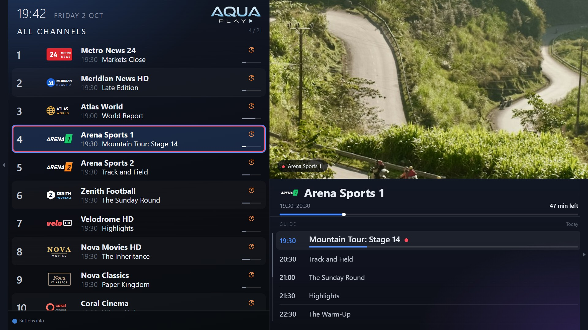
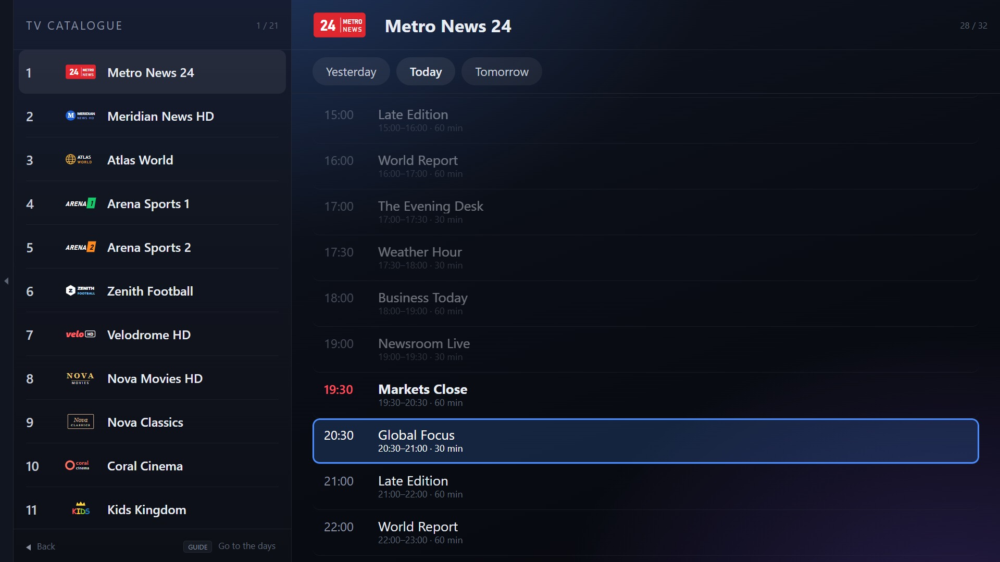
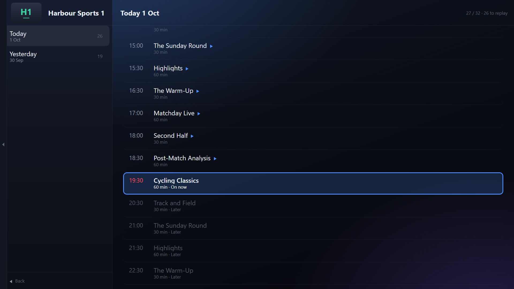
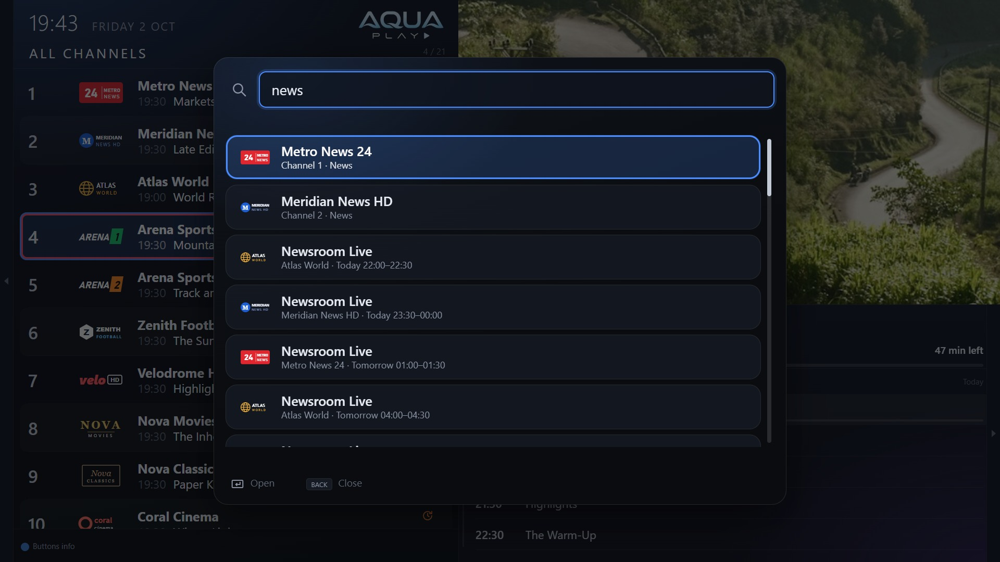
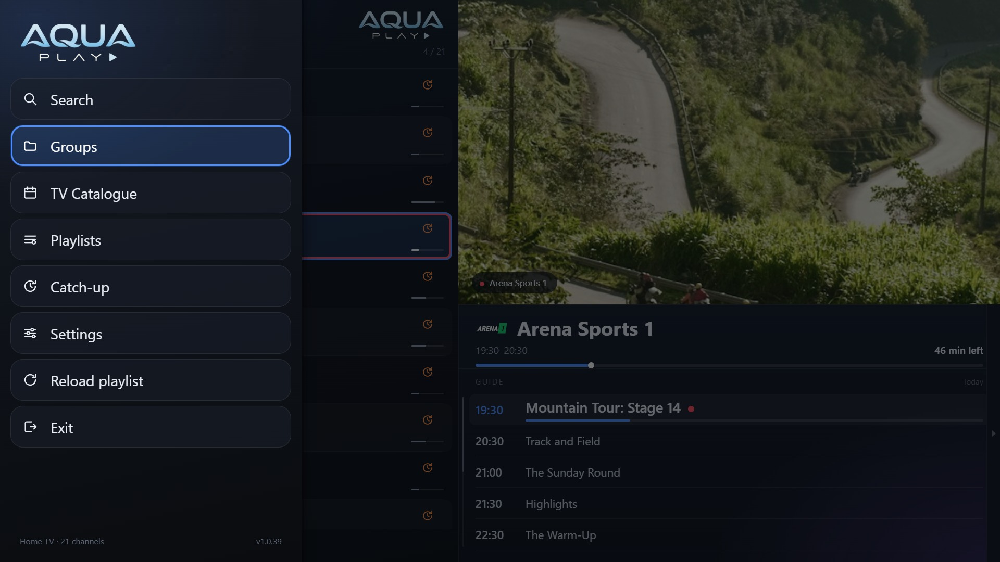

# AquaPlay IPTV for Samsung TVs

A lightweight IPTV player for Samsung Smart TVs (Tizen). **Free, with everything included.**

**[Download the latest version](https://github.com/AquaPlayIPTV/aquaplay-samsung/releases/latest)** · [Install guide](https://aquaplayiptv.github.io/samsung.html) · [Support AquaPlay on Ko-fi](https://ko-fi.com/devdolev)

This repository holds the releases of the Samsung app, ready to install with [Apps2Samsung](https://github.com/Apps2Samsung/Apps2Samsung). AquaPlay's source code is not published.

## What it does

**Setup and playlists**
- M3U playlists and Xtream Codes accounts, several at once
- Setup from your phone: scan a code on the TV and type the details on your phone. The playlist is encrypted on the phone and only your TV can read it.
- Send playlists and settings to another TV, and back up to your phone

**Live TV and the guide**
- Groups, favourites, recently watched, a catch-up group, and the option to hide groups
- A full programme guide: now and next on every channel, the schedule beside the picture, and a TV Catalogue over several days
- Programme reminders, and search across channels and programmes
- Catch-up where your provider has it: replay programmes, start one over, and rewind live TV
- Your own channel numbers and remote buttons

**Movies and series**
- Movies & Series on a screen of their own

**Playback**
- Audio and subtitle tracks, picture size, automatic reconnection, a delay warning and a sleep timer

**Yours**
- Profiles, each with their own favourites and history
- Aqua, OLED and Custom themes with 24 accent colours, three text sizes, ten languages
- Parental PIN and channel locks
- No advertisements, no tracking, no account

AquaPlay is a player only and comes with no channels or content: you need a playlist from your own provider.

| | |
|---|---|
|  |  |
|  |  |

## Install

You need a Samsung Smart TV from 2018 or later (Tizen 4.0 or newer) and a computer (Windows, macOS or Linux) on the same network.

1. **Turn on Developer Mode on the TV.** Open *Apps*, then press **1 2 3 4 5** on the remote (or on the on-screen number pad). Switch *Developer mode* on, type your computer's IP address, choose OK, and restart the TV: hold the power button until it switches off and on again.
2. **Get [Apps2Samsung](https://github.com/Apps2Samsung/Apps2Samsung)** on your computer and open it. It finds your TV.
3. **Download AquaPlay**: the `.wgt` file from the [latest release](https://github.com/AquaPlayIPTV/aquaplay-samsung/releases/latest).
4. **Install it**: in Apps2Samsung, choose your TV, choose to install your own package, and pick the AquaPlay file. The first time, Apps2Samsung may ask you to sign in to a Samsung account, to make the certificate your TV needs.
5. **Open AquaPlay** from the TV's Apps and add your playlist, from the remote or from your phone.

The `.wgt` is unsigned on purpose: Apps2Samsung signs it for your TV as it installs it.

## Updating

Download the new `.wgt` and install it the same way, from the same computer. It replaces the old one and keeps your playlists and settings. From version 1.0.40, AquaPlay tells you itself when a new version is out (once a day it asks GitHub for this repository's latest release; Settings → Advanced turns that off).

A copy installed from a different computer was signed with a different certificate, and the TV will not install over it. Back up to your phone first (AquaPlay's Settings), then delete AquaPlay on the TV (Apps, then the settings gear) and install again.

## Support AquaPlay

AquaPlay is free on Samsung TVs. If you enjoy it, you can say thank you with a donation on **[Ko-fi](https://ko-fi.com/devdolev)**. It is in the app too: Settings, then *Support AquaPlay*.

## Also on Android TV

AquaPlay is on [Google Play](https://play.google.com/store/apps/details?id=com.aquaplay.tv) for Android TV and Google TV, with multi-view and recording as well.

## Questions, problems and ideas

Open an [issue](https://github.com/AquaPlayIPTV/aquaplay-samsung/issues), or write to devdolev@gmail.com. The [privacy policy](https://aquaplayiptv.github.io/privacy.html) says what AquaPlay keeps and sends.

## Licence

Free to use and to share unmodified: see [LICENSE](LICENSE). AquaPlay is not made or endorsed by Samsung; Samsung and Tizen are trademarks of Samsung Electronics.
